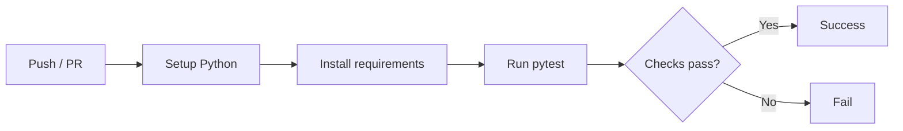

# CI/CD Practice — Skills Showcase

[](https://github.com/JonasBlx/ci-cd-practice/actions/workflows/python-app.yml)


This repository demonstrates CI/CD skills using a simple Python project.  
It is a **minimal example of the CI/CD workflow I implemented during my internship at AC Immune**.

---

## Features

- Python application code in `src/`
- Unit tests with `pytest` in `tests/`
- Workflow automation under `.github/workflows/`
- Dependency management via `requirements.txt`
- Inspired by real-world practices applied at **AC Immune**

---

## Quickstart

```bash
python -m venv .venv
source .venv/bin/activate   # Linux/macOS

pip install -r requirements.txt
pytest -q
```

---



---

```
ci-cd-practice/
├─ .github/workflows/   # GitHub Actions workflows
├─ src/                 # Application code
├─ tests/               # Unit tests
├─ conftest.py          # Pytest configuration
├─ requirements.txt     # Dependencies
└─ README.md
```
